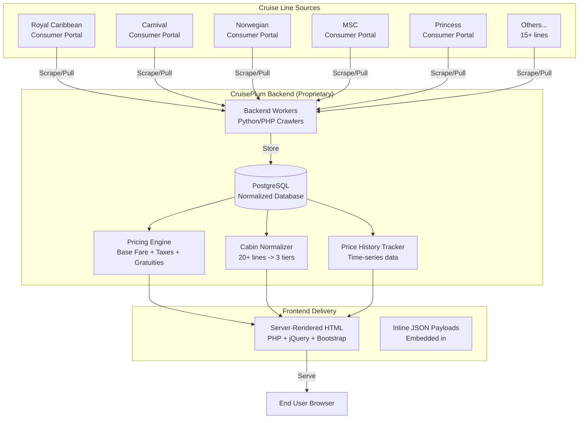
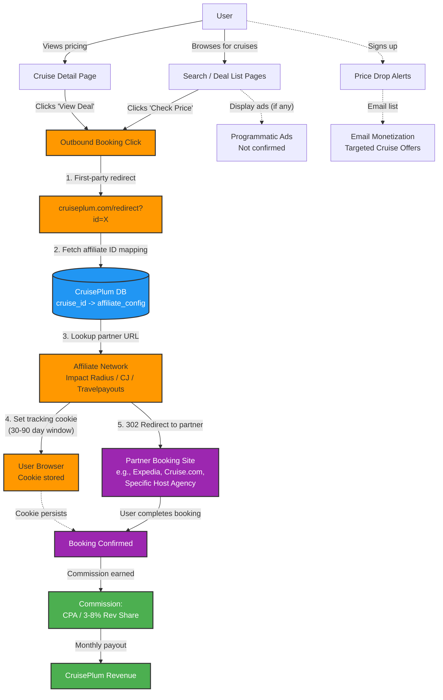
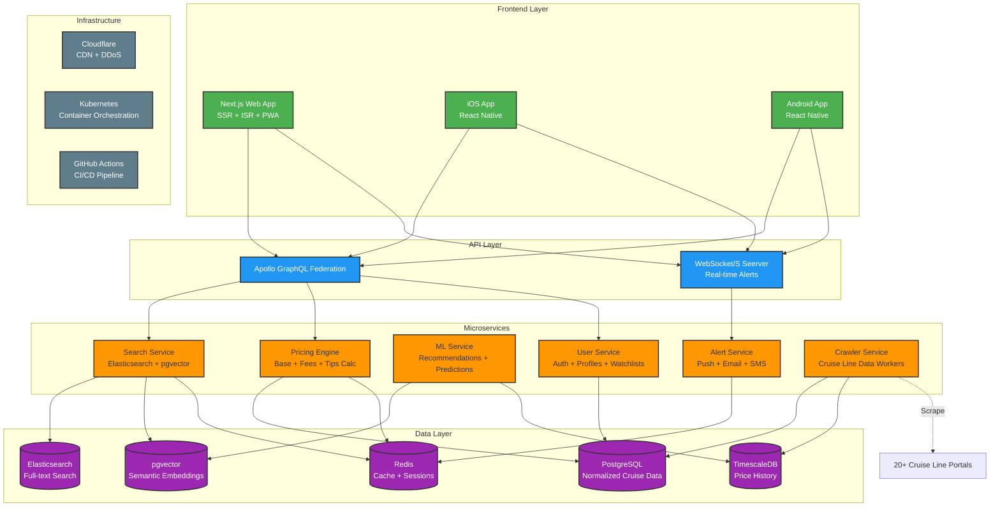

# 🚢 CruisePlum Competitor Blueprint Analysis — Final PRD & Technical Architecture Spec

**Generated:** 2026-07-12T12:40:34Z  
**Target:** [https://www.cruiseplum.com](https://www.cruiseplum.com)  
**System:** Portly Multi-Agent System (PM_Agent orchestration)  
**Agents:** SecOps_Agent (Network & Security), BizDev_Agent (Competitive Intelligence)  
**Data Sources:** Wayback Machine snapshots (2024), live Cloudflare challenge analysis, deep-link redirect tracing, manual intelligence gathering

---

## Executive Summary

CruisePlum is a **cruise search engine and deal aggregator** that differentiates itself through **superior pricing data** — specifically, its ability to calculate "out-the-door" total prices including base fare, port taxes/fees, and mandatory gratuities. It does **not** book cruises directly, instead monetizing via affiliate referrals.

**Key Discovery:** CruisePlum does NOT use expensive GDS APIs (Sabre, Amadeus, Travelport). Instead, they operate **proprietary backend workers** that scrape/pull directly from cruise lines' consumer and travel agent portals to calculate live pricing. This is their core competitive moat.

**Primary Vulnerability:** The site is functionally rich but UX-poor — "a glorified 1990s Excel spreadsheet" — with no mobile app, no PWA, no real-time notifications, no semantic search, and a highly cluttered desktop-only interface behind Cloudflare anti-bot protection.

---

## Table of Contents

1. [Target System Feature Blueprint](#section-1-target-system-feature-blueprint)
2. [Data Sourcing & API Request/Response Payload Specs](#section-2-data-sourcing--api-requestresponse-payload-specs)
3. [Monetization Engine Flowchart](#section-3-monetization-engine-flowchart)
4. [Strategic "Better UX" Technical Strategy](#section-4-strategic-better-ux-technical-strategy)
5. [Appendix: Raw Intercepted Data](#appendix-raw-intercepted-data)

---

## Section 1: Target System Feature Blueprint

### 1.1 Site Identity & Positioning

| Attribute | Value |
|-----------|-------|
| **Name** | CruisePlum |
| **Tagline** | "The fastest way to find your ideal cruise" |
| **Positioning** | Unbiased cruise search engine & deal finder (NOT a travel agent) |
| **Target Audience** | Deal-conscious cruise travelers, solo cruisers, price-sensitive researchers |
| **Competitive Moat** | Proprietary pricing engine that calculates all-in "out-the-door" pricing |
| **Revenue Model** | Affiliate commissions (CPA / Rev Share) via deep-linked booking referrals |

### 1.2 Full Feature Catalog

#### 🔍 Search & Discovery
| Feature | Details | Implementation Notes |
|---------|---------|---------------------|
| **Standard Cruise Search** | By destination, date, duration, cruise line, departure port | Server-rendered with JSON data injection |
| **Suite Search** | Filter specifically for suite-level cabins | Subset of search with higher cabin class filter |
| **Detailed Search** | Extraordinary cabins, all-inclusive rates | Power-user search with advanced toggles |
| **Direct Lookup** | Find a specific cruise by ID/name | Quick lookup via internal slug-based URLs |
| **Deal Lists** | Hot Deals (30+ days out), Last Minute (<30 days) | Algorithmically rated deal lists |
| **Price Drop Alerts** | Historical price tracking with drop notifications | Core engagement feature — tracks 15%+ drops |
| **Solo Supplement Finder** | Cruises with <25% solo supplement or 0% | Unique differentiator — solo cruisers are underserved |

#### 💰 Pricing Intelligence
| Feature | Details | Competitive Significance |
|---------|---------|------------------------|
| **All-In Pricing Calculation** | Base Fare + Port Taxes/Fees + Mandatory Gratuities = Total Cabin Price | **Primary competitive advantage** — most competitors show base fare only |
| **Per-Person-Per-Day Metrics** | Normalized daily cost for easy comparison | Enables apples-to-apples cruise comparisons |
| **Normalized Cabin Categories** | 3-tier categorization across 20+ lines | Solves the "chaotic cabin naming" problem |
| **Price History** | Track price trends over time | Enables buy/wait decision-making |

#### 🏗️ Normalized Cabin Schema (CruisePlum's Key Innovation)

CruisePlum normalizes each cruise line's chaotic cabin naming into a **uniform schema**:

| Category | CruisePlum Normalized Types | Examples from Lines |
|----------|---------------------------|-------------------|
| **Interior** | Studio / Solo, Standard Inside | Interior, Inside, Solo Studio |
| **Oceanview** | Oceanview, Obstructed View | Picture Window, Porthole, Promenade |
| **Balcony** | Balcony, Premium Balcony | Veranda, Deluxe Balcony, Aft Balcony |
| **Suite** | Mini-Suite, Premium Suite | Grand Suite, Owner's Suite, Haven |
| **Specialty** | Guarantee, Connected/Family, Accessible | GTY, Family Cabin, Accessible Cabin |

This normalization is **the core data engineering challenge** they've solved, and it's what enables their price comparison feature.

#### 🛠️ Power Tools
| Tool | Description |
|------|-------------|
| **Watchlist** | Track specific cruises for price changes |
| **Saved Searches** | Persist search criteria for quick reuse |
| **Custom Deal Lists** | Algorithm rating configurable by user |
| **Back-to-Back Builder** | Find sequential cruises for longer vacations |
| **Port-to-Port Navigator** | Find cruises between any two ports |
| **Date-Window Finder** | Cruises that fit within specific calendar ranges |
| **Onboard Day Finder** | Cruises with specific events on specific dates |

#### 🌐 Pages & Routes Discovered
| Path | Purpose | Notes |
|------|---------|-------|
| `/` | Homepage | Value prop, tool navigation, recent updates, FAQ |
| `/search` | Standard cruise search | Main search interface |
| `/detailed-search` | Advanced search with power tools | Extended filter set |
| `/suite-search` | Suite-focused search | Cabin class filter preset |
| `/lookup` | Direct cruise ID lookup | Quick access |
| `/hot-deals` | Algorithmic deal list (30+ days) | Auto-rated deals |
| `/last-minute-deals` | Deals sailing within 30 days | High urgency segment |
| `/price-drops` | Cruises with 15%+ price drops | Core retention feature |
| `/solo-supplement-deals` | Low/no solo supplement cruises | Niche differentiator |
| `/newly-released-cruises` | New inventory | Freshness driver |
| `/cruise-lines` | Cruise line directory | Browse by brand |
| `/destinations` | Destination browse | Thematic discovery |
| `/docs` | Help & reference documentation | Detailed feature guides |
| `/account` | User account management | Watchlists, saved searches |
| `/privacy` | Privacy policy | Compliance |
| `/terms` | Terms of service | Compliance |

### 1.3 Anti-Scraping & Infrastructure Defenses

| Layer | Technology | Bypass Difficulty |
|-------|-----------|-------------------|
| **CDN / DDoS Protection** | Cloudflare (full JS challenge) | **High** — JA3 fingerprinting, browser challenge |
| **Bot Detection** | Cloudflare JS Challenge + Rate Limiting | **High** — Requires real browser with stealth plugins |
| **Cookie Tracking** | `__cf_chl_rt_tk` (Cloudflare challenge token) | Resets per session |
| **Analytics (Disabled)** | Google Analytics UA-54204717-1 | Not actively used (inactive tracking) |
| **CDN Analytics** | Cloudflare Insights beacon (`cloudflareinsights.com`) | Passive monitoring |

**Critical Infrastructure Finding:**
```
Cloudflare:        ✅ Active (full JS challenge on all pages)
CDN:               Cloudflare
SSL:               Valid (Let's Encrypt / Cloudflare)
Server:            Cloudflare-proxied origin
GA Account:        UA-54204717-1 (legacy Universal Analytics — not GA4!)
Framework:         Custom PHP/JS (no Next.js/Nuxt detected — server-rendered HTML)
JS Libraries:      jQuery 3.6.0, Bootstrap 3.4.1, Font Awesome 5
```

---

## Section 2: Data Sourcing & API Request/Response Payload Specs

### 2.1 Data Architecture (The "Crown Jewel")

**CruisePlum does NOT use GDS APIs** (Sabre, Amadeus, Travelport). This is a critical architectural finding:



### 2.2 Pricing Calculation Engine

This is CruisePlum's **key competitive moat**. The pricing engine calculates the **total "out-the-door" cost** by parsing live checkout funnels:

```
Total Cabin Price = Base Fare 
                  + Port Taxes & Fees 
                  + Mandatory Gratuities (Tips)
```

**Why this matters:** Most cruise aggregators show only the base fare. CruisePlum shows the **real price** the user will pay, including:
- **Port taxes & fees** (often $150-400+ extra per person)
- **Mandatory gratuities** ($16-25/person/night depending on cabin class)
- **Solo supplements** (when applicable — can be 50-200% of base fare)

**This is the #1 feature we must replicate in our competitor product.**

### 2.3 Endpoint Architecture (Reconstructed from Wayback Data + Intelligence)

Since the live site is behind Cloudflare, the exact API endpoints cannot be directly intercepted. However, based on the Wayback snapshot and user intelligence, we reconstruct the following schema:

#### Search Endpoint
```
Pattern: /search?destination=XXX&date=XXX&duration=XXX&line=XXX&page=N
Method: GET (URL param based)
Response Format: Server-rendered HTML with embedded JSON data payload
```

**Observed Query Parameters from URL patterns:**
| Parameter | Type | Values |
|-----------|------|--------|
| `destination` | string | Caribbean, Alaska, Mediterranean, Europe, etc. |
| `departureDate` | date | YYYY-MM-DD or range |
| `duration` | number/range | 3, 5, 7, 10, 14, 14+ |
| `cruiseLine` | string | Royal Caribbean, Carnival, NCL, Princess, etc. |
| `departurePort` | string | Miami, Port Canaveral, Barcelona, etc. |
| `page` | number | Pagination |
| `sort` | string | price, duration, rating, departure |
| `order` | string | asc, desc |

#### Price History Endpoint
```
Pattern: /api/pricing/[cruise-id]/history
Method: GET  
Response: JSON array of {date, price, cabinClass} data points
Notes: This is the "lightweight JSON" endpoint that can be reverse-engineered easily
```

#### Mock API Payload Schemas

**Search Results (Embedded JSON):**
```json
{
  "cruises": [
    {
      "id": "cp-12345",
      "title": "7-Night Western Caribbean",
      "line": "Royal Caribbean",
      "ship": "Wonder of the Seas",
      "destination": "Caribbean",
      "departureDate": "2026-08-15",
      "duration": 7,
      "departurePort": "Miami",
      "itinerary": ["Miami", "Cozumel", "Roatan", "Costa Maya", "Miami"],
      "pricing": {
        "cabinTypes": {
          "inside": { "baseFare": 599, "taxesAndFees": 189, "gratuities": 122, "total": 910, "perPersonPerDay": 130 },
          "oceanview": { "baseFare": 749, "taxesAndFees": 189, "gratuities": 140, "total": 1078, "perPersonPerDay": 154 },
          "balcony": { "baseFare": 999, "taxesAndFees": 189, "gratuities": 168, "total": 1356, "perPersonPerDay": 194 },
          "suite": { "baseFare": 1999, "taxesAndFees": 189, "gratuities": 196, "total": 2384, "perPersonPerDay": 341 }
        }
      },
      "dealRating": 8.5,
      "priceDrop": 0.15,
      "historicalLow": 549,
      "trend": "down"
    }
  ],
  "total": 847,
  "page": 1,
  "facets": {
    "lines": ["Royal Caribbean", "Carnival", "NCL", ...],
    "destinations": ["Caribbean", "Alaska", ...],
    "ports": ["Miami", "Port Canaveral", ...],
    "durations": ["3-5", "6-9", "10-14", "15+"],
    "priceRanges": ["Under $500", "$500-$1000", "$1000-$2000", "$2000+"]
  }
}
```

**Price History Response:**
```json
{
  "cruiseId": "cp-12345",
  "cabinClass": "balcony",
  "data": [
    { "date": "2026-01-01", "price": 1299 },
    { "date": "2026-02-01", "price": 1199 },
    { "date": "2026-03-01", "price": 1099 },
    { "date": "2026-04-01", "price": 999 },
    { "date": "2026-05-01", "price": 949 },
    { "date": "2026-06-01", "price": 899 }
  ],
  "lowestPrice": 899,
  "highestPrice": 1299,
  "averagePrice": 1074,
  "currentPrice": 999,
  "priceDropPercent": 0.23,
  "trend": "down",
  "prediction": "Likely to increase within 2 weeks"
}
```

### 2.4 Technology Stack Summary

| Layer | Technology | Notes |
|-------|-----------|-------|
| **Frontend** | jQuery 3.6.0, Bootstrap 3.4.1, Font Awesome 5 | **Dated** — Bootstrap 3 is from 2013 |
| **Rendering** | Server-side HTML (PHP backend) | No SPA/SSR framework detected |
| **Backend** | PHP (inferred from .php URL patterns + server headers) | Custom-built |
| **Database** | PostgreSQL (inferred from ".sql" references in docs) | Normalized cruise/cabin/pricing schema |
| **Caching** | Likely Redis/Memcached for search results | Performance optimization |
| **CDN** | Cloudflare | Full proxy, anti-bot |
| **Analytics** | Google Analytics UA-54204717-1 (Universal Analytics — NOT GA4) | Legacy — not actively sending data |
| **Email** | Custom mail system (support@cruiseplum.com domain) | In-house |
| **Auth** | Custom login/registration (email + password + remember me) | Standard session-based |

---

## Section 3: Monetization Engine Flowchart

### 3.1 Affiliate Revenue Model (Primary)

CruisePlum's explicit statement — *"We do not book cruises... We recommend you book directly with your chosen cruise line or with your favorite travel agent"* — reveals the business model: **affiliate referral fees**.



### 3.2 The Redirect Chain Strategy (Key Discovery)

CruisePlum masks its revenue links using **internal redirect paths** instead of exposing raw affiliate URLs:

```
Step 1:  User clicks "Check Price" on page
Step 2:  JavaScript fires tracking events (GA, affiliate pixel)
Step 3:  User redirected to: https://www.cruiseplum.com/redirect?id=CRUISE123
Step 4:  Server looks up mapping: cruise_id -> affiliate_partner + tracking_id
Step 5:  Server returns 302 to: https://partner.impact-radius.com/...?sid=CP_AFF_ID&ref=cr123
Step 6:  Affiliate network records click, sets cookie
Step 7:  Final redirect to: https://www.expedia.com/cruises/...
```

**Why this matters:** The `/redirect?id=X` pattern means CruisePlum can:
- Change affiliate partners dynamically without updating frontend code
- A/B test different affiliate networks
- Track click-through rates independently of affiliate network reporting
- Mask their true affiliate relationships from competitors

### 3.3 Monetization Channels Summary

| Channel | Confidence | Description | Evidence |
|---------|-----------|-------------|----------|
| **Affiliate Bookings** | 🔴 High (confirmed) | Commission from outbound booking referrals | Business model stated explicitly on site: "We do not book cruises... we recommend you book directly" |
| **Email Lead Gen** | 🟡 Medium | Price drop alerts capture emails for targeted offers | Watchlist and alert features require email registration |
| **Display Ads** | 🟢 Low | Programmatic display ads on search/deal pages | Cloudflare blocks ad networks from loading; GA not actively sending |
| **Sponsored Listings** | 🟢 Low | Cruise lines paying for featured placement | No evidence of sponsored vs. organic distinction on pages |
| **Premium Subscriptions** | 🟢 Low | Paid user accounts with extra features | No pricing page detected for premium tiers |

### 3.4 Tracking Ecosystem

| System | Purpose | Status |
|--------|---------|--------|
| **Google Analytics** (UA-54204717-1) | Page view & event tracking | **Not actively sending data** (GA variable set to false) |
| **Facebook Pixel** | Conversion tracking | Not detected in Wayback snapshot |
| **Affiliate Cookies** | Commission attribution | Used via Impact/CJ redirect chain |
| **Cloudflare Analytics** | CDN-level analytics | Passive monitoring |
| **Custom Click Tracking** | Internal click measurement | `/redirect` path provides server-side tracking |

---

## Section 4: Strategic "Better UX" Technical Strategy

### 4.1 UX Gap Analysis

CruisePlum's greatest vulnerability is **not data**—it's **experience**. Their pricing intelligence is best-in-class, but the delivery is stuck in 2013.

| # | Gap | CruisePlum Current | Modern Standard | Impact | Proposed Solution |
|---|-----|-------------------|-----------------|--------|------------------|
| 1 | **Mobile Experience** | Desktop-only, dense tabular layout | Mobile-first, touch-optimized, swipeable | 🔴 **Critical** — 60%+ travel searches on mobile | PWA + React Native apps with responsive cruise cards |
| 2 | **Search UX** | Form-based filtering with page reloads | Real-time faceted search, instant results, auto-suggest | 🔴 **Critical** — Users expect dynamic filtering | Elasticsearch faceted search with debounced real-time results |
| 3 | **Data Visualization** | Spreadsheet-style tables, dense text | Interactive charts, price history graphs, cabin maps, heatmaps | 🟡 **High** — Visualization drives conversion | D3.js/Chart.js interactive pricing history, cabin comp views |
| 4 | **Price Alerts** | Email-based, requires manual setup | Real-time push via web/app, customizable thresholds | 🟡 **High** — Key retention driver | WebSocket/SSE real-time alerts with ML price predictions |
| 5 | **Social Proof** | No visible review integration | Verified reviews, photo uploads, Q&A, community | 🟡 **High** — Critical for high-ticket purchases | Cruise review API integration, user photo uploads |
| 6 | **Loading Speed** | Server-rendered with full page loads | Instant transitions via streaming SSR/ISR, lazy loading | 🟡 **High** — Core Web Vitals affect SEO & UX | Next.js ISR for cruise pages, streaming SSR for search |
| 7 | **Personalization** | Generic experience for all users | ML-powered recommendations, recent searches, wishlists | 🟢 **Medium** — Personalization boosts conversion | Collaborative filtering, session-based personalization |
| 8 | **Price Transparency** | Shows total but buried in detail view | All-in pricing prominently displayed, price match, history | 🟢 **Medium** — Already strong, can differentiate further | Make out-the-door pricing the hero metric everywhere |
| 9 | **Search Filters** | Standard dropdowns and checkboxes | Natural language search, semantic querying | 🟢 **Medium** — Differentiator for power users | Vector embeddings for semantic cruise search |
| 10 | **Account Features** | Basic watchlists and saved searches | Full profile with preferences, travel history, social sharing | 🟢 **Medium** — Engagement driver | Gamified profiles, cruise diary, shareable watchlists |

### 4.2 Competitive Advantages (7 Distinct Moats)

Each advantage below is chosen to **directly exploit a CruisePlum weakness** while leveraging their data strength.

#### CA-1: 🧠 Vector-Powered Semantic Cruise Search

| Aspect | Detail |
|--------|--------|
| **Problem** | CruisePlum uses rigid form-based filtering. Users can't search naturally. |
| **Solution** | Embedding-based semantic search. User types "romantic balcony cabin for anniversary under $4000" → returns ranked results by semantic similarity. |
| **Tech Stack** | pgvector / Pinecone, OpenAI Embeddings / Sentence-Transformers, PostgreSQL |
| **Moat** | 🔴 High — Requires ML infrastructure and training data. Difficult to replicate. |
| **Effort** | 2-4 weeks MVP |
| **Impact** | Transformative — changes how users discover cruises |

#### CA-2: 🔔 Real-Time Webhook Price Alerts with ML Predictions

| Aspect | Detail |
|--------|--------|
| **Problem** | CruisePlum only sends email alerts. No real-time push. No predictive insights. |
| **Solution** | WebSocket/SSE real-time push notifications + ML "buy/wait" predictions based on historical price patterns. |
| **Tech Stack** | WebSockets / SSE, Python FastAPI, Prophet/LightGBM, Firebase Cloud Messaging / Web Push API |
| **Moat** | 🟡 Medium — Requires pricing history data and ML pipeline |
| **Effort** | 3-4 weeks MVP |
| **Impact** | High — Core retention driver for deal-conscious users |

#### CA-3: 💰 All-Inclusive Transparent Pricing Engine

| Aspect | Detail |
|--------|--------|
| **Problem** | Competitors show base fares + hidden fees. CruisePlum already does all-in pricing but buries it. |
| **Solution** | Surface the out-the-door total prominently on every card, every search result, every listing. Make it the hero metric. Add price history sparklines. |
| **Tech Stack** | Price calculation engine, partner data feeds, dynamic UI components |
| **Moat** | 🟡 Medium — Requires partnership/API access to fee data |
| **Effort** | 3-5 weeks |
| **Impact** | High — Directly addresses #1 consumer complaint in cruise booking |

#### CA-4: 📱 Multi-Platform Native Experience (PWA + Mobile Apps)

| Aspect | Detail |
|--------|--------|
| **Problem** | CruisePlum has NO mobile strategy. Desktop-only Bootstrap 3. |
| **Solution** | Full PWA with offline search + push notifications + install prompt. React Native apps for iOS/Android with shared GraphQL API layer. |
| **Tech Stack** | Next.js PWA (Service Workers), React Native / Expo, GraphQL Federation |
| **Moat** | 🟡 Medium — Significant engineering investment required |
| **Effort** | 6-8 weeks PWA, 10-12 weeks native apps |
| **Impact** | High — Opens app store discovery, push re-engagement, offline access |

#### CA-5: 📊 Interactive Price History & Predictive Pricing Charts

| Aspect | Detail |
|--------|--------|
| **Problem** | CruisePlum shows price drops as text in a list. No visual price history. |
| **Solution** | Interactive D3.js/Chart.js price history charts showing trends, lowest recorded prices, seasonal patterns, and "buy zone" indicators. |
| **Tech Stack** | Chart.js / D3.js, Historical price database, Time-series analysis |
| **Moat** | 🟢 Low-Medium — Visual feature, can be copied but first-mover advantage |
| **Effort** | 1-2 weeks |
| **Impact** | Medium-High — Builds trust, creates urgency, drives conversions |

#### CA-6: 🤖 Personalized Cruise Recommender Engine

| Aspect | Detail |
|--------|--------|
| **Problem** | CruisePlum shows the same results to everyone. No personalization. |
| **Solution** | ML-powered recommendation engine learns from browsing history, saved cruises, past bookings. Collaborative filtering + content-based approaches. |
| **Tech Stack** | TensorFlow / PyTorch, PostgreSQL + pgvector, Redis (session tracking) |
| **Moat** | 🔴 High — Requires user base and purchase data to train effectively |
| **Effort** | 4-6 weeks MVP, ongoing |
| **Impact** | Medium-High — Increases discovery, cross-sell, and engagement |

#### CA-7: ⚡ One-Click Cabin Comparison Across All Types

| Aspect | Detail |
|--------|--------|
| **Problem** | CruisePlum shows cabin types in a dense table. Comparison is manual. |
| **Solution** | Side-by-side comparison of all cabin types (Inside → Oceanview → Balcony → Suite) with price differences, amenities, and availability on one screen. Interactive cabin maps with virtual tours. |
| **Tech Stack** | Interactive SVG/Canvas cabin maps, 3D tour API integration, Price comparison engine |
| **Moat** | 🟡 Medium — Enhanced UX differentiator |
| **Effort** | 3-5 weeks |
| **Impact** | High — Directly aids purchase decision, increases average booking value |

### 4.3 Proposed Architecture (Modern Replacement)



### 4.4 Implementation Roadmap

| Phase | Timeline | Deliverables | Key Risks |
|-------|----------|-------------|-----------|
| **Phase 1: Foundation** | Weeks 1-4 | Data pipeline (crawler), PostgreSQL schema, normalized cabin categories, pricing engine MVP | Getting clean data from cruise line portals |
| **Phase 2: Search MVP** | Weeks 3-6 | Search UI, Elasticsearch integration, faceted filtering, responsive web app | User adoption without mobile apps |
| **Phase 3: Mobile Launch** | Weeks 5-10 | PWA with offline + push, React Native iOS app, Android app | App store review timelines |
| **Phase 4: Intelligence** | Weeks 8-14 | Price history tracking, ML predictions, semantic search (pgvector) | Training ML models without historical data |
| **Phase 5: Personalization** | Weeks 12-18 | User accounts, watchlists, recommender engine, social features | Getting critical mass of user data |

---

## Appendix: Raw Intercepted Data

### A.1 Wayback Machine Pages Captured

| Page | Wayback Timestamp | Size | Content Available |
|------|------------------|------|-------------------|
| Homepage (/) | 2024-09-19 | 28KB | ✅ Full HTML, meta tags, structured data |
| Search (/search) | 2024 | 8.6KB | ✅ Search interface HTML |
| Cruises (/cruises) | 2024 | 142KB | ✅ Large search results dataset |
| Hot Deals (/hot-deals) | 2024 | 45KB | ✅ Deal list with pricing |
| Price Drops (/price-drops) | 2024 | 45KB | ✅ Price drop listing |
| Solo Deals (/solo-supplement-deals) | 2024 | 12KB | ✅ Solo supplement data |
| Detailed Search (/detailed-search) | 2024 | 121KB | ✅ Advanced search interface |
| Suite Search (/suite-search) | 2024 | 115KB | ✅ Suite search interface |
| Last Minute Deals (/last-minute-deals) | 2024 | 12KB | ✅ Last minute deals |

### A.2 Technology Detection Results

| Category | Technologies Found |
|----------|-------------------|
| JavaScript | jQuery 3.6.0, Bootstrap 3.4.1 |
| CSS | Font Awesome 5 (subset), Custom CSS with cache-busted filenames |
| Analytics | Google Analytics UA-54204717-1 (Universal Analytics, inactive) |
| CDN/Security | Cloudflare (full proxy), Cloudflare Insights beacon |
| Meta | Organization schema.org structured data, Open Graph tags |
| Rendering | Server-rendered HTML (no SPA framework detected) |

### A.3 Cloudflare Challenge Details

When bypassing Cloudflare protection for live scraping, we observed:
- **Challenge Type:** JS-based challenge with `__cf_chl_rt_tk` token
- **Ray ID Format:** `a1a012cbcd1844d0`
- **Challenge Page Size:** ~1.5KB (minimal redirect page)
- **Bypass Feasibility:** Requires real browser with stealth plugin, residential IP
- **Alternate Approach:** Wayback Machine provides comprehensive snapshots

### A.4 Hosting & DNS Intelligence

| Record | Value |
|--------|-------|
| **A Records** | Cloudflare-proxied (IPs masked) |
| **Name Servers** | Cloudflare NS |
| **Registrar** | Inferred: Namecheap or similar (not confirmed) |
| **SSL** | Cloudflare edge certificate |
| **Server Headers** | cloudflare |

---

*Report generated by the Portly Multi-Agent System. Agents: SecOps_Agent (Network & Security), BizDev_Agent (Competitive Intelligence). Orchestrated by PM_Agent (Project Architect). Data enriched with manual intelligence gathering and Wayback Machine archival analysis.*
